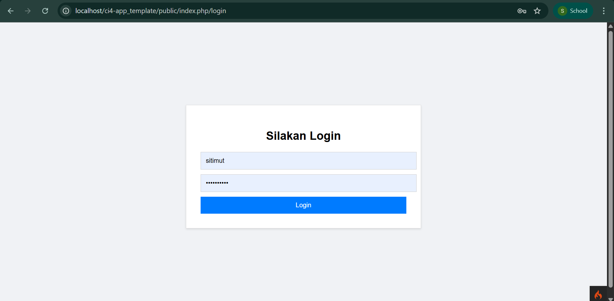
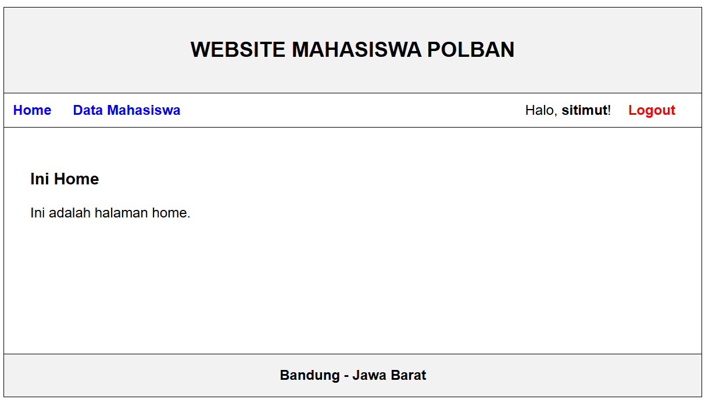
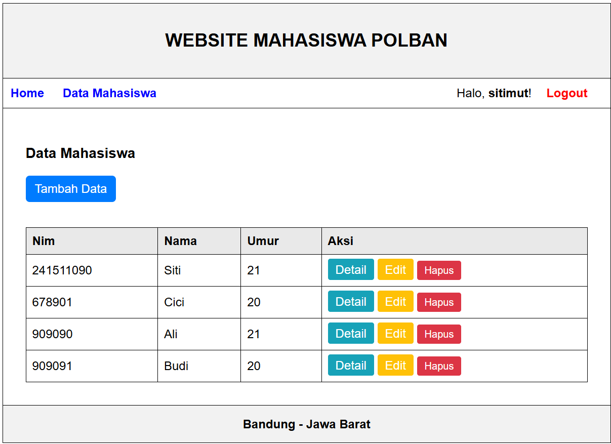

# 📌 Dokumentasi Project Tugas

## `ci4-app_template` (Revisi & Pengembangan)
✨ Folder ini merupakan **revisi dan pengembangan** dari proyek `ci4-app` sebelumnya.

Aplikasi di dalam folder ini dibangun di atas fondasi MVC yang sama, namun dengan penambahan beberapa fitur untuk menjadikannya sebuah aplikasi web sederhana yang fungsional dan aman.

**Peningkatan utama meliputi:**
* **Sistem Layout/Templating:** Menggunakan satu file template utama untuk memastikan tampilan yang konsisten di semua halaman (header, menu, footer).
* **Fungsionalitas CRUD Penuh:** Implementasi Create, Read, Update, dan Delete untuk data mahasiswa.
* **Validasi Form Server-Side:** Memastikan semua data yang masuk ke database aman dan sesuai dengan aturan yang ditetapkan.
* **Sistem Autentikasi:** Fitur Login dan Logout yang aman untuk melindungi halaman.
* **Struktur Kode yang Lebih Baik:** Menggunakan Filter, Grup Rute, dan Session untuk manajemen aplikasi yang lebih profesional.

---

## ✨ Fitur Utama (`ci4-app_template`)
* Manajemen Data Mahasiswa (CRUD)
* Login & Logout Pengguna
* Validasi Form untuk Tambah & Edit Data
* Pesan Notifikasi (Flash Message) untuk setiap aksi
* Tampilan yang Konsisten di Semua Halaman

---

## ⚙️ Persiapan & Cara Menjalankan (`ci4-app_template`)

### Prasyarat
* PHP 8.1 atau lebih baru
* Composer
* Server Database (misalnya MySQL dari XAMPP)

### Cara 1: Development Server (Direkomendasikan)
Ini adalah cara termudah dan tercepat untuk menjalankan proyek saat pengembangan.

1.  **Buka Terminal/CMD** di dalam folder `ci4-app_template`.
2.  **Install Dependensi:** Jalankan perintah berikut untuk mengunduh semua pustaka yang dibutuhkan.
    ```bash
    composer install
    ```
3.  **Konfigurasi Environment:** Salin file `env` menjadi `.env`. File `.env` adalah tempat Anda menyimpan semua konfigurasi.
    ```bash
    cp env .env
    ```
4.  **Buka file `.env`** dan sesuaikan baris berikut dengan konfigurasi database Anda:
    ```env
    database.default.hostname = localhost
    database.default.database = akademis_db
    database.default.username = root
    database.default.password = 
    ```
    Jangan lupa untuk mengatur `app.baseURL` juga:
    ```env
    app.baseURL = 'http://localhost:8080/'
    ```
5.  **Jalankan Server:** Ketik perintah berikut di terminal.
    ```bash
    php spark serve
    ```
6.  **Buka di Browser:** Akses URL yang muncul, biasanya **http://localhost:8080**.

### Cara 2: Menggunakan XAMPP / Apache
1.  Pastikan sudah mengaktifkan **Apache + MySQL** dari XAMPP Control Panel.
2.  Simpan folder `ci4-app_template` di dalam `C:\xampp\htdocs`.
3.  Lakukan langkah **konfigurasi `.env`** seperti pada Cara 1, namun sesuaikan `app.baseURL` menjadi:
    ```env
    app.baseURL = 'http://localhost/ci4-app_template/public/'
    ```
4.  Akses melalui browser: **http://localhost/ci4-app_template/public/**

> 💡 **Tips Profesional:** Untuk menghilangkan `/public` dari URL saat menggunakan XAMPP, Anda dapat mengkonfigurasi **Virtual Host** di Apache.

## Dokumentasi Program


