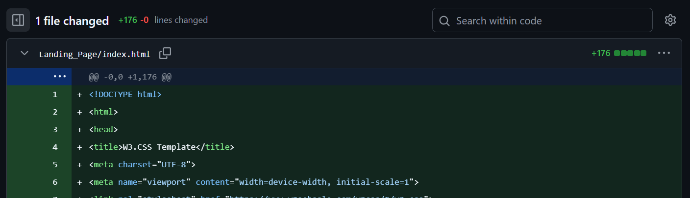
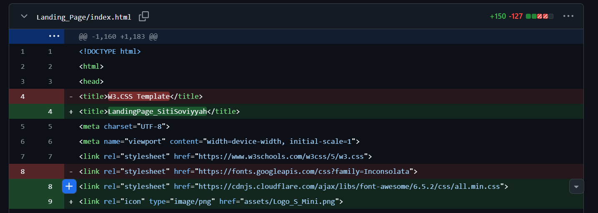
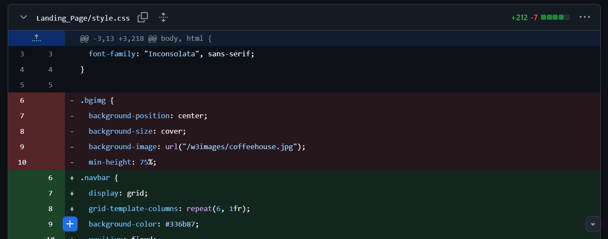

# Proyek3_Pengembangan_Perangkat_Lunak_Web
# Responsive Website Project

## A. Penjelasan Singkat tentang Proyek
Proyek ini adalah pengembangan website responsif yang dapat menyesuaikan tampilan pada berbagai ukuran layar, mulai dari desktop hingga perangkat mobile. Fokus utama proyek ini adalah memastikan tata letak, ukuran elemen, dan navigasi tetap optimal di semua perangkat.  

## B. Teknologi yang Digunakan
- **HTML5** untuk struktur halaman  
- **CSS3** (termasuk media query & satuan responsif seperti %) untuk desain responsif   
- **Framework W3.CSS** untuk mempercepat pengembangan UI

## C. Bukti Modifikasi Framework
Proyek ini telah melakukan modifikasi melalui:
- Penyesuaian variabel dan warna tema  
- Penambahan stylesheet kustom (`style.css`) untuk mengubah tampilan default  
- Optimasi layout agar sesuai dengan kebutuhan proyek 
- Sebelum modifikasi:
 

- Sesudah modifikasi:

## D. Link Deployment
