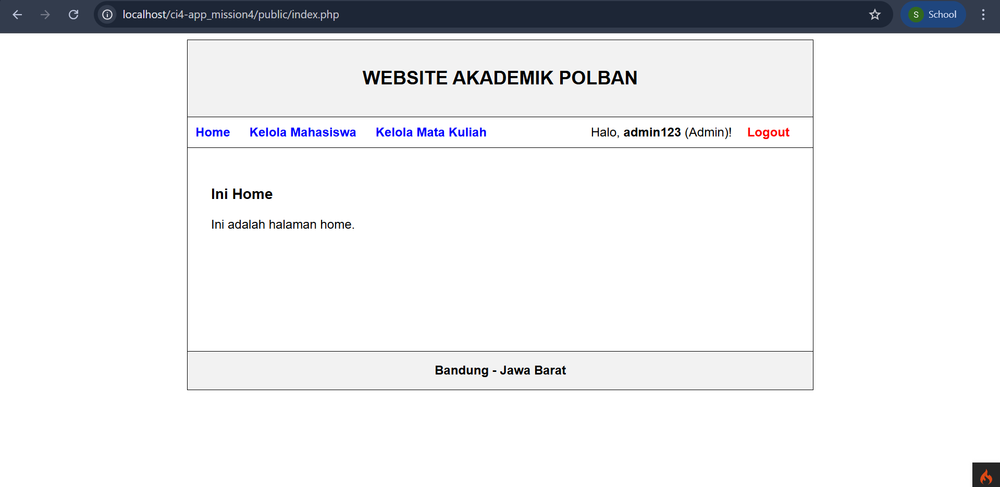
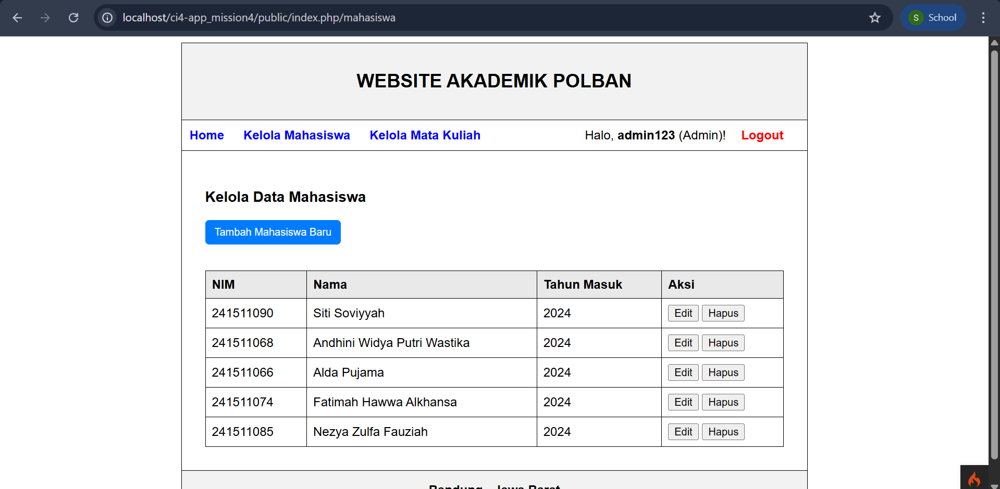
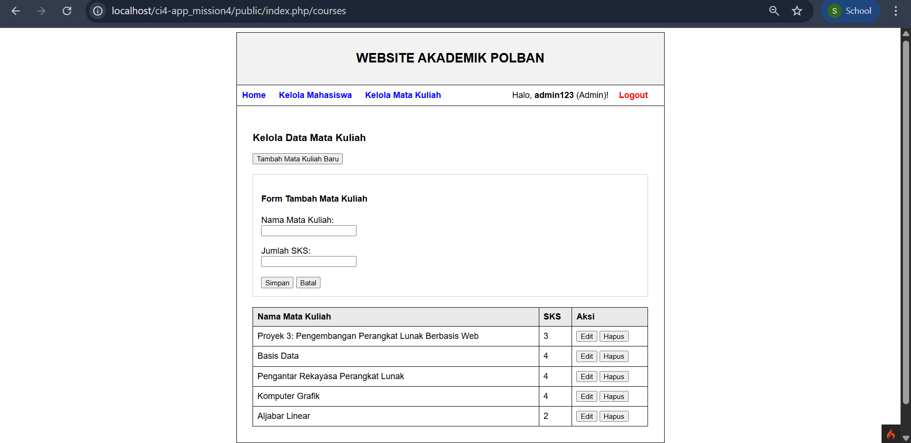
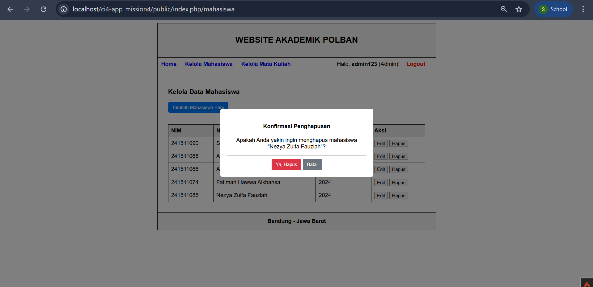
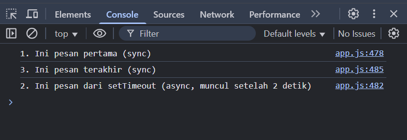

# 📚 Website Akademik Polban

Proyek ini adalah implementasi sederhana dari sistem akademik berbasis web menggunakan **CodeIgniter 4 + JavaScript**, dengan fokus pada manipulasi DOM, validasi form, dan interaksi data menggunakan array of objects.

---

## ✨ Fitur

### 1️⃣ Scope, Array, & Object
Data mahasiswa (`students`) dan mata kuliah (`courses`) disimpan dalam **array of objects**.

### 2️⃣ DOM Selector & Manipulation
- Menggunakan getElementById, querySelector, dan createElement() untuk:
- Menampilkan tabel data mahasiswa & mata kuliah.
- Menambahkan elemen baru ke DOM secara dinamis.

### 3️⃣ Event Handling
- addEventListener digunakan untuk menangani:
    - Klik tombol Tambah, Edit, dan Hapus.
    - Submit form.
- Validasi Form: Jika input kosong → tampilkan pesan error & border merah (.is-invalid).
- Ambil Mata Kuliah:
    - Mahasiswa bisa memilih banyak course dengan checkbox.
    - Total SKS otomatis diperbarui setiap kali checklist berubah.
    - Submit akan menyimpan data yang dipilih.

### 4️⃣ Common Use Cases
- Menu Aktif: Link menu otomatis berubah style (underline + warna kuning) sesuai halaman.
- Form Validation: Pesan error tampil di bawah input + border merah.
- Delete Confirmation: Dialog konfirmasi sebelum menghapus data, menampilkan nama mata kuliah & SKS.

### 5️⃣ Sync vs Async
- Contoh Async: Menggunakan setTimeout untuk simulasi proses async.
- Persiapan REST API: Endpoint untuk courses/enroll sudah disiapkan di Routes.php untuk menerima data via fetch().

## 🛠️ Teknologi yang Digunakan
- PHP 8 + CodeIgniter 4 → Backend & Routing
- JavaScript (ES6) → DOM manipulation, event handling, async fetch
- HTML5 + CSS3 → Tampilan UI
- Fetch API → Kirim data ke backend
- CSRF Token → Keamanan form

## Screenshoot Hasil Uji Coba
- Halaman Home + Menu Aktif

- Kelola Mahasiswa

- Kelola Mata Kuliah + Form Validation

- Modal Konfirmasi Hapus

- Contoh setTimeout (Async)
